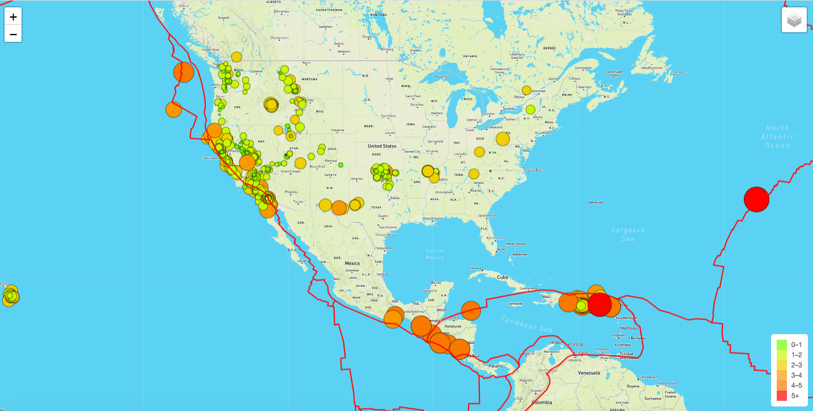

# Mapping_Earthquakes

## Purpose
The purpose of this project is to map Earthquake data. Users can filter the map based on 'All Earthquakes', 'Tectonic Plates', and 'Major Earthquakes'. The map is customizable by style: street, satellite, and dark.

